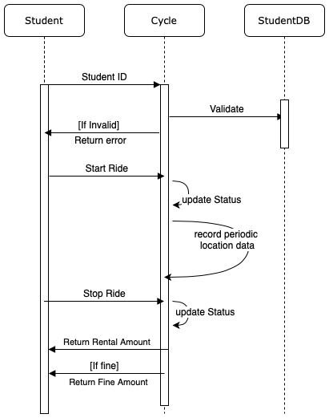

# Assignment 1

## Context Diagram (Level 0 DFD)

* A student can register to the `Bike Renting System` with his Student ID, Email address, he will be getting a response which can be an error message or a success message with his newly created ID.
* Student can enter his ID to the `Lock/Unlock System` Interface. 
* This will send a command to unlock one of the cycles after verification of ID.
* Admin will send a command to get the results of the statistics required, and the reponse is the output.

## Use Case Diagram

* Student has two main use cases - `Resgister` to register into the system and `Get Ride` to get a cycle.
* Admin has a use case, he can access the statistics of all the cycles for information like least used cycles, most used paths, crowding of deposit zones...
* These main use cases include other basic functions as shown in the image.

## Class Diagram

* The Student class has three variables (Name, ID, Email) and one operation getID() method to be used while logging in.
* The Student DB class is used at the main server, which has collection of registered students. It should support methods like adding, removing and validating a student which also includes checking for duplicates. This class in an aggregation of Student Class.
* The Cycle class has variables ID, Status(rented or free), Statistics, Location.
* The location variable is of `Coordinate` type which is another class
* The Statistics variable is of `CycleStatistics` type which has long term information about that cyle which the monitoring functionality can use.
* The CycleStatistics class has Path(as a list of Coordinates) and LastUsed(time) variables and methods to update them with every new ride. The first and last Coordinates of each Path are considered to be deposit zones.
* The CyclesStatistics class is a 1:1 composition with Cycle class, it doesn't have independant existence.
* The Monitor class consists of a list of all Cycles. It is an aggregation of Cycle Class since the cycles can be added or removed. It has methods to calculate most used Deposit zones, Paths and least used cycles from the cycleStatistics of each cycle class.

## Sequence Diagram

We have two main use cases from the prespective of the actual user and one from the admin.

### Use Case 1

* This is for the register use case. The flow of information and the procedure of registration can be easily understood from the diagram

### Use Case 2

* This is for the register use case. The flow of information and the procedure of registration can be easily understood from the diagram

* This is for the getRide use case. 
* Validation, messages for starting and stopping rides and location data collection to the Cycle class can be clearly seen.

This can be more detailed, but for simplicity many simple actions are omitted.

### Use Case 3

* This is for the monitor use case from the admin.
* Statistics data will be collected from all the cyles and methods for getting the required features will be run.
